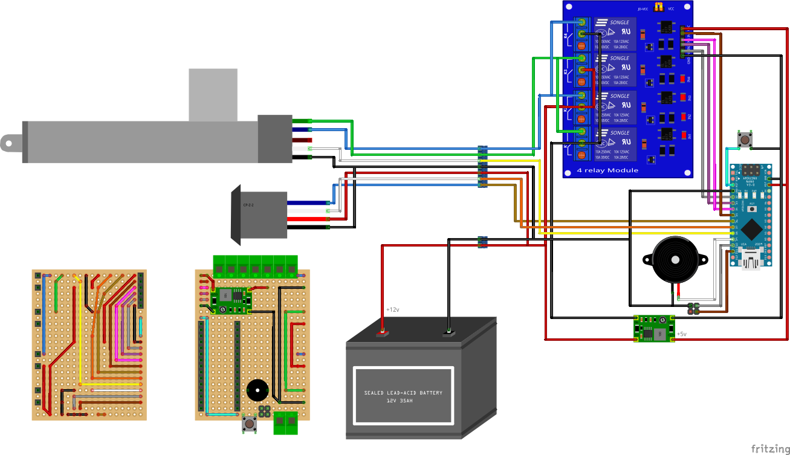
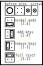

# RFID Car Lock

This project is an Arduino-based device that controls a car lock using an RFID reader. It allows for keyless entry to the car by reading an RFID tag and unlocking the doors if the tag matches the authorized tag in the system.

## Hardware Requirements

To build this project, I used the following components:

- Arduino Nano
- Ironlogic CP-Z-2 RFID 125 Khz reader
- Standard 5-wire car lock actuator
- TZT 5V 4 channel relay module
- Mini360 DC-DC step down converter
- Standard passive buzzer
- Breadboard, wires, male and female pins, jumper, button, screw connectors

## Circuit Diagram

Ironlogic CP-Z-2 reader operates in DS-1990A emulation mode and sends the key code via D1 (white) using the 1-wire protocol. D0 (blue) is used to wake up the Arduino controller from deep sleep mode.

The lock is controlled through a relay module by applying direct and inverted voltage to the actuator wires (green and blue). The white wire of the actuator is used to read the current lock position (open/closed).

The jumper is used to set the operating modes. The button is used to reboot the device. The buzzer is used for device status indication.

## Software Requirements

External libraries used in the project:
- [OneWire](https://github.com/paulstoffregen/OneWire)
- [LowPower](https://github.com/LowPowerLab/LowPower)

To build and upload the project, you can use the following components:

- [PlatformIO Core](https://docs.platformio.org/en/latest/core/installation.html)
- [Visual Studio Code](https://code.visualstudio.com/) 

## Installation

1. Clone the repository to your local machine.
2. Connect the Arduino to your computer using a USB cable.
3. Make sure that the Arduino is properly recognized by your system.
4. Open the project folder in Visual Studio Code.
5. In VS Code, open the Terminal and run the command `pio run` to build the project.

## Usage

Set up operating mode using the jumper and reboot the device.

### Normal mode

No jumper or pins 3-4 are shorted. On startup the buzzer emits one short beep.

When applying an rfid key, if the key is authorized, the lock changes its state and the buzzer emits long high tone beep.

If the key is not authorized, or opening/closing the lock failed, the buzzer emits long low tone beep.

### Add keys

Jumper is set to short 2-4 pins. On startup the buzzer emits two short beeps: one medium and one high tone.

When applying an rfid key, one short beep sounds and device try to save the key. After that:

- Long high tone beep - the key was successfully written to memory.

- Long low tone beep - the key already exists, or max count of keys reached.

### Remove keys

Jumper is set to short 1-3 pins. On startup the buzzer emits three short beeps: one medium and two high tone.

When applying an rfid key, two short beep sounds and device try to remove the key from memory. After that:

- Long high tone beep - the key was successfully removed from memory.

- Long low tone beep - the key not found.

### Full reset

Jumper is set to short 1-2 pins. On startup the buzzer emits five short beeps: one medium tone and four high ones. After that, the device EEPROM is completely erased.

## 3D Printed Case

I made a very simple case for 3D printing, but it needs some modification in place. Here are STL files:

- [Lower Body](assets/car_rfid_case_1.stl)
- [Top Case](assets/car_rfid_case_2.stl)

## Additional images

- [Breadboard top](assets/breadboard_01.jpg)
- [Breadboard bottom](assets/breadboard_02.jpg)
- [Breadboard assembled](assets/breadboard_03.jpg)
- [3D-printed case](assets/case_01.jpg)
- [Case modification](assets/case_02.jpg)